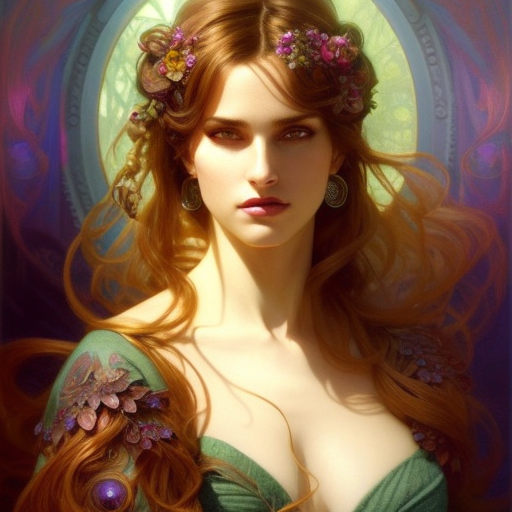

# Ai Avatar Generator

This is a custom trained Image generator model using Google's Dreambooth and Stable Diffusion 1.5. The front-end uses React and Next.js and the site is hosted on Vercel.
[Ai Avatar Generator live site](https://bencem-ai-avatar.vercel.app/).

## Table of contents

- [Overview](#overview)
  - [The project](#the-project)
  - [My Approach](#my-approach)
  - [Research](#research)
  - [Links](#links)
- [My process](#my-process)
  - [Built with](#built-with)
  - [What I learned](#what-i-learned)
  - [Continued development](#continued-development)
- [Images](#example-images)
- [Author](#author)

## Overview

### The project

The project should be able to:

- Generate an image using prompts
- Submit a prompt using an `input` field and a `button`
- The prompt should be submitted to an api call that interacts with the model
- The model should be hosted on [HuggingFace](https://huggingface.co/)
- The model should understand certain words that refer to me as a person and utilise it
- The app should be able to handle the api's response
- The app should display the response as an `image`
- Should work well on most displays

### Links

- [The Live Site](https://bencem-ai-avatar.vercel.app/)
- [HuggingFace](https://huggingface.co/)
- [Google Colab](https://colab.research.google.com/)
- [React Documentation](https://beta.reactjs.org/)
- [Vercel](https://vercel.com/)
- [Jupyter Notebook](https://jupyter.org/)
- [Next Docs](https://nextjs.org/docs)
- [Next Learn](https://nextjs.org/learn/foundations/about-nextjs)

### My Approach

#### The Model

1. I had to train the image generator model to understand my face. This is a very computer intensive process, so I used Google's virtual machines
2. I had to save this model
3. I had to host this model as generating images is also a computer intensive process

#### The App

1. The app had to be responsive
2. The app should be able to utilise serverless functions
3. The app should be able to interact with the hosted model

### Research

I've done thorough research of various concepts and tried out many apps and models to see how they work and how can I best interact with it.

Prompting:

- Twitter thread of styles: [Thread](https://twitter.com/fabianstelzer/status/1599525776952414208)
- Various youtube videos of prompts: [Vid1](https://www.youtube.com/watch?v=9ErPUGlifQQ) [Vid2](https://www.youtube.com/watch?v=apQylm17E_0)
- Best website to fiddle around with different models: [Playgroundai](https://playgroundai.com/)
- Dall-e prompt book: [Book-pdf](http://dallery.gallery/wp-content/uploads/2022/07/The-DALL%C2%B7E-2-prompt-book-v1.02.pdf)
- Midjourney: [Midjourney](https://www.midjourney.com/home/?callbackUrl=%2Fapp%2F)
- Lexica [Lexica](https://lexica.art/)

Click to See the Prompt

The prompt:
fantasy beautiful face goddess, in hibernation box, hyperdetailed painting, complex, head and shoulders portrait, 4k resolution concept art portrait by Greg Rutkowski, Artgerm, WLOP, Alphonse Mucha dynamic lighting hyperdetailed intricately detailed art trending on Artstation triadic colors Unreal Engine 5 volumetric lighting handsome, evil devil, gothic, short brunet hair, evil smirk, big green eyes, young, pop, elegant, life, father, clear, deep color art, Greg Rutkowski art, fantasycore, airbrush art, black and white still, digital Art, perfect composition, beautiful detailed intricate insanely detailed octane render trending on artstation, 8 k artistic photography, photorealistic concept art, soft natural volumetric cinematic perfect light, chiaroscuro, award - winning photograph, masterpiece, oil on canvas, raphael, caravaggio, greg rutkowski, beeple, beksinski, giger, perfect composition, beautiful detailed intricate insanely detailed octane render trending on artstation, 8 k artistic photography, photorealistic concept art, soft natural volumetric cinematic perfect light, chiaroscuro, award - winning photograph, masterpiece, oil on canvas, raphael, caravaggio, greg rutkowski, beeple, beksinski, giger, trending on artstation, sharp focus, studio photo, intricate details, highly detailed, by greg rutkowski, sf, intricate artwork masterpiece, ominous, matte painting movie poster, golden ratio, trending on cgsociety, intricate, epic, trending on artstation, by artgerm, h. r. giger and beksinski, highly detailed, vibrant, production cinematic character render, ultra high quality model, sf, intricate artwork masterpiece, ominous, matte painting movie poster, golden ratio, trending on cgsociety, intricate, armor, epic, trending on artstation, by artgerm, h. r. giger and beksinski, highly detailed, vibrant, production cinematic character render, ultra high quality model
Negatives:
Distorted, helmet, crown, bad topology, extra limbs, extra hands, watermarked, blurry. Over exposed, 2 heads, 2 faces, cropped image, out of frame, draft

  

Model:

- How Stable Diffusion works: [Link](https://jalammar.github.io/illustrated-stable-diffusion/)
- Dreambooth: [Link](https://dreambooth.github.io/)
- HuggingFace: [Link](https://huggingface.co/docs)
- Python scripts: [Shivam Shrirao](https://github.com/ShivamShrirao)

## My process

### Built with

- Dreambooth
- Stable Diffusion 1.5
- React.js
- Next.js
- Mobile-first workflow
- HuggingFace
- Google Colab
- Jupyter Notebook
- Vercel

### The Building Process

#### Model

1. Install Dependencies:

- pytorch
- triton
- diffusers [Shivam Shrirao](https://github.com/ShivamShrirao/diffusers)
- xformers (for language processing) [Colab Optimised](https://github.com/brian6091/xformers-wheels/releases)
- accelerate

2. Connect to HF with api key to be able to use Stable diffusion
3. Model Config
4. Creating your instance and class prompt + providing the training Images
5. Configure training options (iterations, backup, model name, learning rate etc.)
6. Setting weights
7. Test
8. Converting the diffusers into stable diffusion model (.ckpt)
9. Setting the model up for prompts
10. Save the model host it on HF

Training phases:

  

#### The App

Now that the model is finished and hosted we need to create an interface between the User and the Model.
I used Next and Vercel to do this.

1. create-next-app
2. Basic html and css setup
3. Setting up our serverless function call
4. Creating the API call
5. Handling the response + parsing the data
6. Handling 503 repsonse and setting states to keep track of retries
7. Clearing the input and displaying the image
8. Making the site responsive

### What I learned

There have been a lot of new concepts in this project and a few familiar ones. The Model training was the bigger part, even if I utilised github repos to do the heavy lifting of the python scripts.

- Concepts behind image generating models
- How to train these models
- I spent about 20 hours learning prompting
- Hosting these models and interacting with them
- React
- Next.js
- Encoding (only the surface)
- Serverless Functions

### Continued development

I ran into several limitations during this project. Most of them boils down to lack of computing power and having to outsource all these processes.

There would be several ways to improve this build:

- Having my own computer that is able to handle the training and the image generation
- HuggingFace removes the model from its cache/memory to better utilise their rented computers, so some calls can take a while to process, having a computer would also enable the model to be faster to repsond and wouldn't need HuggingFace
- Displaying already generated images and live updating it every time a new one is generated
- Finding a host that doesn't time out serverless functions

I kept this project free. If I went the premium route I'd have rented a computer from AWS or Azure.

## Example Images

  
  
  

## Author

Bence Meszaros

- Website - "Coming Soon"
- GitHub - [@BenceM](https://github.com/BenceM)
